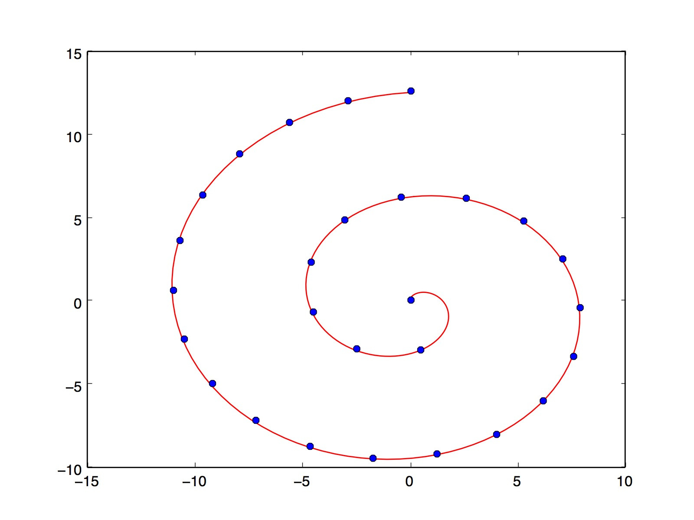

# PyAMPL

A simple bridge between AMPL and Python allowing users to define external functions in Python and use those functions inside AMPL models.

This example bridge is used to define a parametric curve in Python, to be used in the AMPL model. It should generalize easily to other cases.

## Compilation notes on Mac Intel

You may simply install the [ASL](http://www.ampl.com/netlib/ampl/solvers.tgz) by hand or use [Homebrew](http://brew.sh):

    brew install python --universal
    brew tap homebrew/science
    brew install asl
    make [DEBUG=1]  # Should output config options and create amplfunc.dll

## Prerequisites

There are no Python prerequisites to run the simple example supplied. You need an [AMPL](http://www.ampl.com) engine (the [student version](http://ampl.com/DOWNLOADS/details.html#Unix) will do for this small example). AMPL comes pre-packaged with the [MINOS](http://www.stanford.edu/group/SOL/minos.htm) solver. Unfortunately, MINOS doesn't seem to find a solution of this particular problem. In the example, I used [SNOPT](http://www.stanford.edu/group/SOL/snopt.htm). You can download a [student version of SNOPT](http://ampl.com/DOWNLOADS/details.html#SNOPT) from the AMPL website.

If you want to run `plot.py` and check the results for yourself, you'll need [Numpy](http://www.numpy.org/) and [Matplotlib](http://matplotlib.org/). Installing them is easy:

    brew install matplotlib

If you don't use `brew`, you can install them with `pip`, but you might have to install some dependencies by hand:

    easy_install pip
    pip install numpy
    pip install matplotlib

## Running the Example

We're now ready to run the AMPL script `curve.ampl`. This script does a few things:

* it defines external functions that initialize and finalize the Python interpreter, and point to our Python functions
* it loads the model `curve.mod` and data `curve.dat`
* it solves the problem with `snopt`
* it writes the solution to file in `x.dat` and `y.dat`.

The problem described in `curve.mod` consists in finding 25 points on a spiral curve that are equidistant. Here, equidistant means relative to the Euclidian distance, not to the curvilinear distance. The problem and solution process are described in [these proceedings](http://www.crm.umontreal.ca/probindustriels2011/pdf/cr2011.pdf), pages 41-58. Running it is straightforward:

    ampl curve.ampl

You should see output similar to

    SNOPT 7.2-5 : Optimal solution found.
    10 iterations, objective 8.913330871
    Nonlin evals: obj = 8, grad = 7, constrs = 8, Jac = 7.

This produces `x.dat` and `y.dat`. Running

    python plot.py

should produce a plot similar to

Alternatively, you could use [Gnuplot](http://www.gnuplot.info/) (`brew install gnuplot`).

## More Info

It's probably a good idea to scan the [official documentation](http://netlib.org/ampl/solvers/funclink/) on how to define external functions in AMPL models.

Most of the magic happens in
[`funcadd.c`](https://github.com/dpo/pyampl/blob/master/funcadd.c).
